## Introduction

This tool allows a user to gain remote code execution with root priviledges through the deployment of an evil-twin rogue access point, DNS poisioning, and a phishing attack. Firefox Cena allows the user to carry out the following steps:

1. **Interface Initialization**: Enabling of monitor mode on user-specified network interface.
2. **Network Enumeration**: Enumerate local wireless networks in order to find a network worth impersonating.
3. **Network Spoofing**: Execute an 'Evil-Twin' attack, by spoofing the BSSID and ESSID of the target network.
4. **Traffic Redirection**: Redirect all http traffic to our evil apache server 
5. **Deauthentication**: Deauthenticate clients of legitimate network so that clients can connect to spoofed network.
6. **Phishing**: Using a pair of cloned and modified firefox sites, instruct the user to install the evil payload.
7. **Payload Installation**: Upon execution of update script by client, installs TTS application and image viewer as well as minutely crontab which harasses client by running TTS in background and displaying an excessive amount of images of john cena in addition to a monero CPU mining client that deposits mining rewards into the attackers wallet.

## Explanation

### Interface Initialization

Firefox Cena takes a single command line argument which dictates the network interface to be used for the procedure. 

`python3 cant-see-me.py <network-interface>`

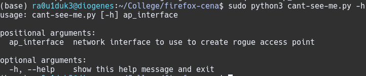

In order to allow execution of the evil twin attack and direct all of the victims web traffic to our webserver, the first subroutine executed by FC is setting the network interface to Monitor mode using airmon-ng. This is done so that we can monitor local wireless packets and create a rogue access point.

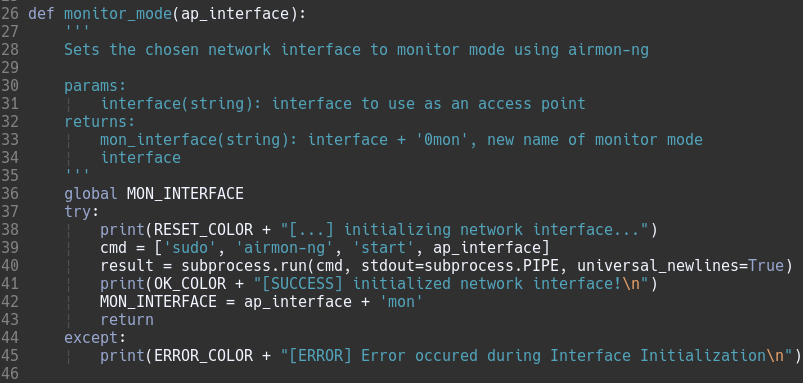

### Network Enumeration
The second phase of Firefox Cena consists of identifying potential networks that can be spoofed. This is done by performing a packet capture on the locally accessible wireless networks using airodump to capture key information to present to the user, namely; BSSIDs, ESSIDs, and the number of data packets sent in the past 30 seconds. 

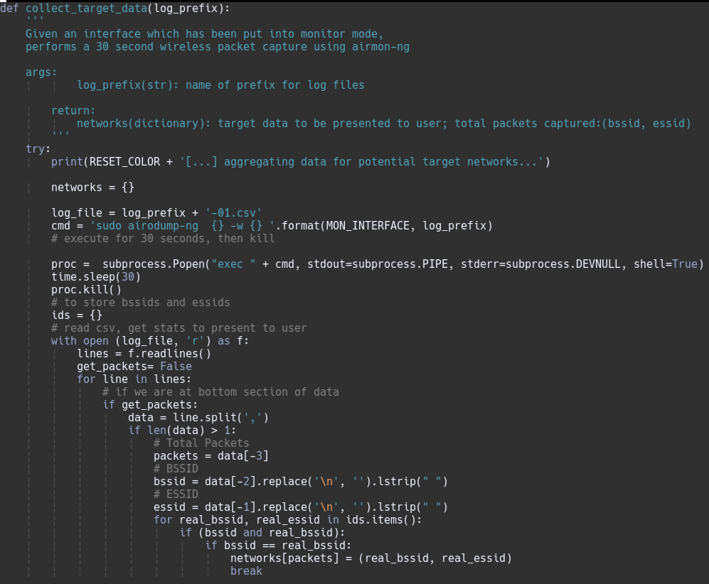

The user is then presented with a number of options in descending order w.r.t the number of packets sent as the assumption is that higher data transmission on a network results in larger pool of potential victims

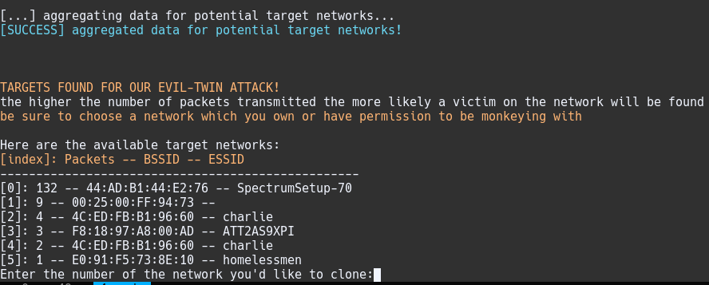

### Network Spoofing
Once a user has chosen the network that they would like to clone, FC clones the network using airbase-ng. By default, the network is cloned on channel 1 with the interface provided by the user. This is important to note because unless the user has two network interfaces, they will become disconnected from the internet as their interface will be too busy acting as an access point to provide internet access. 

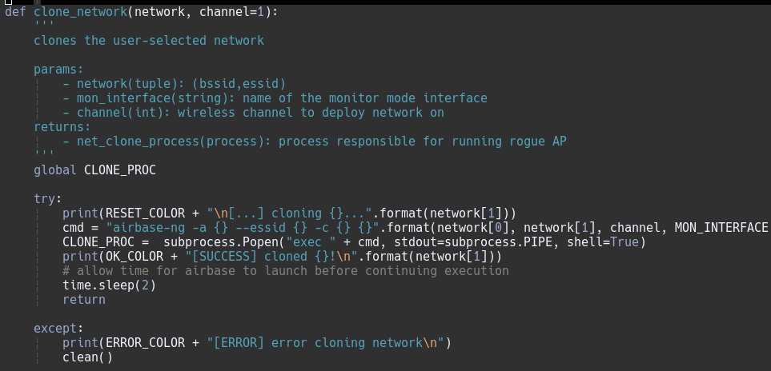

After cloning the network, FC also allocates an IP address for the interface along with a subnet and instantiates a DHCP server for the network using ip and dhcpd.

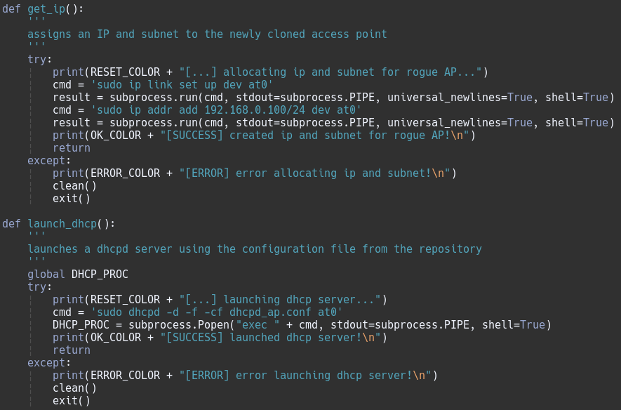

The ip address allocated for the access point is 192.168.0.100/24, which is important to note as this is the ip we will need to be sending our dns requests to since the same machine will also host the dns server.

### Traffic Redirection
Since FC controls the DHCP server and can tell clients where the DNS server is, FC includes a configuration file that tells dhcpd to point to our local interface as the domain name server. 
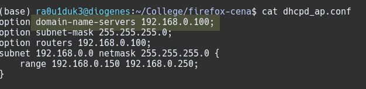

Immediately after launching dhcpd, FC spins up an instance of dnschef that listens on the AP interface and points to the same IP, resulting in all http traffic being redirected to our machine.

### Phishing
In order to execute code at root level on the victim machine, FC spins up an apache2 server with a cloned and modified firefox error page. 
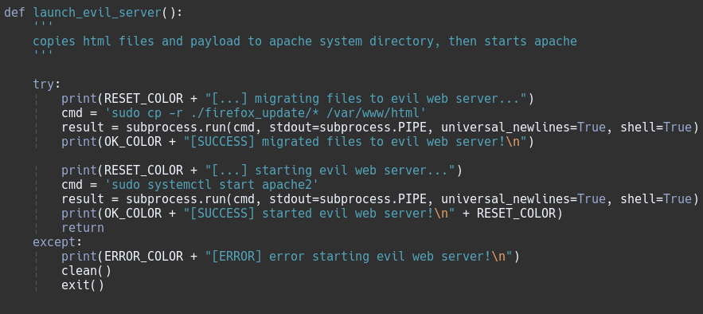

This page notifies the user that their browser is out of date and that in order to continue, they must press the button below to update their browser.

After pressing the update button, the user is directed to another cloned and modified firefox page which instructs them to download an update script and execute it with root-level priviledges.
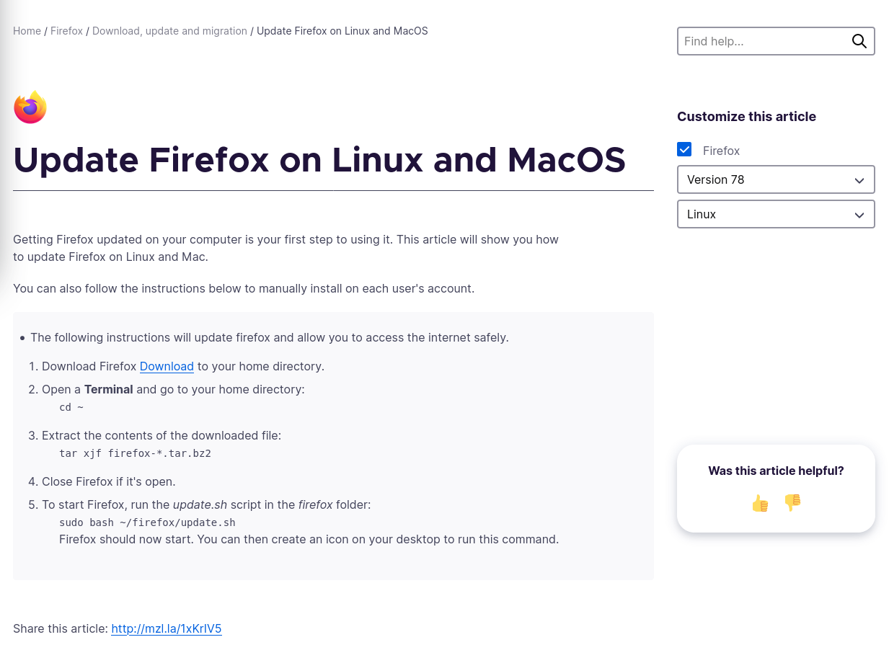

### Deauthentication
In order to ensure that clients actually connect to our rogue access point, FC uses aireplay-ng, a wireless packet injector tool to send deauthentication packets to clients of the legitimate access point.
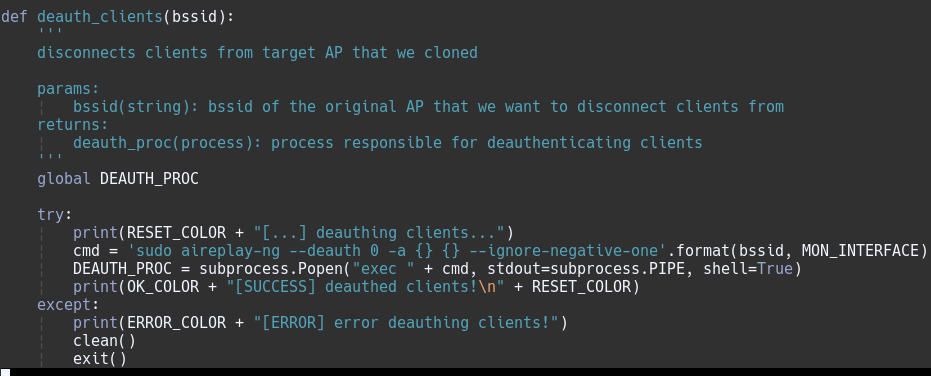

If a client is in closer proximity to or has a better signal from our rogue access point, they should automatically connect to it instead of connecting to the legitimate access point, providing us with victims to continue executing our attack on. If this is not the case, it is still possible for victims to connect to our network, though it would require the victim to manually select our network (which shouldn't be too much to ask since our rogue AP has the same essid).

### Payload Installation
The payload takes the form of a bash script. There are four main objectives of the payload; install dependencies, hide assets, establish cronjobs, and deploy the crypto-currency miner. 

1. Dependency Installation:
The dependencies installed are festival and imagemagick, tools for text-to-speech and image display respectively. These will be used to provide a nonsensical audiovisual harassment of the victim.
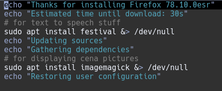

2. Asset Hiding:
There are five main assets that will be used to harass the victim and utilize their computer to mine crypto-currency on the users behalf. The first asset is an image of john cena that will be displayed 20 times every minute on the victims monitor. The second and third assets are text files that will be converted to minute-long audio using festival to be deployed every minute. The fourth asset is a script that will be used to trigger the audiovisual experience. The execution of this script is to be installed as a cronjob. Finally, the fifth asset is a Monero CPU mining client. 
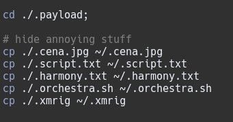

3. Establish Cronjobs:
Once assets are hidden, a cronjob is installed to execute the orchestra script every minute.
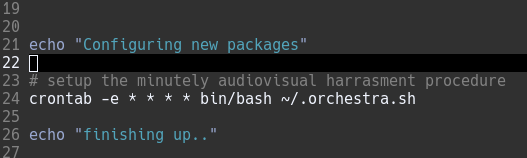
 
5. Deploy Crypto-currency Miner:
The final objective of the payload is to deploy the monero miner. I chose this crypto-currency miner for two reasons; it uses the randomx proof-of-work algorithm which is more competitive on CPUs than GPUs (which is important because although most victims won't have a GPU, they are all guaranteed to have a CPU), and Monero uses [Cryptonote](https://en.wikipedia.org/wiki/CryptoNote), an application layer protocol that aims to guarantee transaction anonymity if used properly. xmrig comes as an executable, and uses the configuration file found in the working directory, which I have modified to contain my public address so that the rewards from the mining will be sent to my wallet.
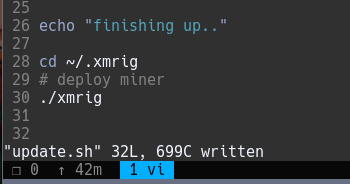

## Tools Table
- airmon-ng: Used for enabling monitor mode on a Network Interface Card.
- airodump-ng: Used for performing wireless packet captures.
- airbase-ng: Used for creating the rogue acess point using the monitor mode NIC.
- aireplay-ng: Used for deauthenticating clients from the legitimate access point.
- ip: Used to declare an IP address and subnet for the rogue access point.
- dhcpd: Used to provide dhcp services to the rogue AP and direct clients to our nefarious dns server.
- apache2: Used to host the phishing site.
- dnschef: Used for forging dns entries so that victims may be redirected to our apache2 web server.
- festival: Used for text-to-speech audio emission on the victims machine.
- imagemagick: Used to display images to the victims machine.
- cron: Used to schedule the minutely audiovisual harrasment of the user with the 2 preceeding tools.
- xmrig: Used to mine monero using the victims machine.

## Attack
1. Firefox Cena Deployment 
2. Enumeration
3. User Network Selection
4. Network Deployment and Final Attack Setup
5. Victim Connection
6. Victim-Triggered Pwn

## Report 

### Evaluation 
The first big lesson I learned revolved around how rogue AP's work. I felt as though we went over it from a high-level in class and it made sense but actually getting to implement and deploy a rogue AP made clear to me the relationship between BSSIDs, ESSIDs, beacon packets, and the aircrack-ng suite of wireless tools. Even though I didn't use every tool from the suite, I still feel as though I learned a good amount about the tools that I did use.

The second lesson I walked away from this project with pertains to the interaction between a router, dhcp server, and domain name server. I had heard the term 'dhcp' and feel as though I had a firm understanding of DNS and routers, but didn't really get where a DHCP server fits into this picture. After having to configure my own dhcp server using dhcpd, the relationship between these three concepts became very clear to me, which I think is awesome because it seems as though its a really important part of a network infrastructure.

The last lesson I learned was the result of one of the bigger issues with firefox cena, the lack of ability to redirect https traffic. Due to this flaw, you'll notice that large parts of you-cant-see-me.py are commented out as those methods were drafted for v2, the next iteration of this tool in which I plan to rollout support for https. Though I didn't complete this feature as it seemed to require an extra monitor-mode capable NIC which I currently don't have, I learned alot about sslstrip, a tool created by Moxie Marlinspike. I think I already had a reasonable understanding of ssl for http as I implemented TLS 1.2 in a project last semester, but learning about sslstrip and reading about Moxie Marlinspikes research, I was able to think about TLS from the perspective of an attacker, something I had not done before. I also learned quite a bit about iptables since it will be used in v2 for rerouting traffic to our sslstrip instance which I think was incredibly helpful.

### Issues 
I already mentioned the biggest flaw with this tool which is lack of support for https. 15 years ago this might not have been a big deal, but given most reputable sites are now redirecting traffic on port 80 to https on port 443, lots of sites that users visit will not be able to be spoofed using dnschef and therefore will result in user never reaching our phishing server. In order to support this feature, the user must have two monitor-mode capable NICs, which I currently do not have so development on this feature was a bit difficult. I made a good bit of progress but extensive testing will need to wait until I acquire a new NIC.

Not having a password on the rogue AP also is detrimental if the legitimate network has one. Many modern OS's will give the victim a security warning if they connect to our passwordless rogue AP and the legitimate AP required a password.

Automatic connection to the rogue AP after deauthentication from the legitimate AP is also quite spotty. During testing there were only a few instances that the victim actually connected to our rogue AP after being deauthenticated from the legitimate AP and I believe this is only because the machine had already connected to the rogue AP previously. In most cases, the victim will actually need to manually select our rogue AP in order for the attack to continue.

### Future Improvements 
The first future improvement that is most pressing in my opinion is https support. I already have all of the code drafted, and will just need to conduct testing once acquiring a new NIC.

The second improvement is in response to our second issue, the lack of password that results in users being warned of security issue upon connecting to our rogue AP. I did a bit of research into captive portals and WPA2 hash cracking and I think it would be interesting to implement the option to detect use of captive portal in networks and employ either captive portals or WPA2 hash-cracking to provide the user with a more legitimate looking network.

Another potential enhancement is modification of the update.sh script to instead be contained in a dpkg. It seems quite easy for a victim to just open up the script and recognize the nefarious code. I considered compiling the bash into binary using shc, but think that a dpkg would be a more elegant solution to the problem as most internet packages for linux are dpkgs anyways.

This current version does not have a very high degree of user configuration. It would be nice to implement more command line options such that the attacker could decide on certain aspects of the attack such as, the operating system and browser to target, the payload to deliver, the IP and subnet to use, the monero address to deposit mining rewards to, etc.

Another possible enhancement is the creation of a systemd unit file for xmrig. This would allow for xmrig to start on boot. Currently, if a victim reboots their machine, the only persistance would be with respect to the audiovisual harrasment, which may not be nearly as important to the attacker as the use of the victim's CPU for crypto-currency mining. Installing a systemd unit file and enabling xmrig using systemctl would allow for the mining to remain persistant across reboots as well.

There is also currently no way for the attacker to clean up or remove the malware from the victim machine after a ransom is paid or the attacker decides they are done with the attack. A solution to this would be creating a persistent backdoor using a netcat reverse-shell scheduled either as a cronjob, or deployed on boot using systemctl along with a script to disable and remove the miner and audiovisual harrasment assets.

Implementing a 'silent' mode would also be interesting. I envision this as a mode of execution in which the audiovisual harrasment is not employed and instead, upon user execution of the script, xmrig is deployed and enabled with systemctl and a persistent backdoor is created with connection information is relayed to the attacker so they can continue using the victim machine as they please.

